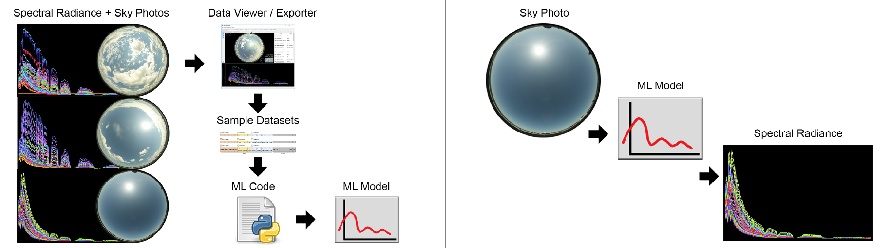

# SpectralSkyLearn

## Description

Machine learning a regression model between sky photos and spectral radiance measurements, for downstream predictions given a sky photo. There are many uses for collections of full sky spectral radiance curves, including building performance simulation and real-time monitoring systems, PBRT renderers, PV panel alignment, etc.  
  
Contact [Dr. Joe Kider](https://www.josephkider.com) for sky photos and spectral radiance captured at Cornell University used on this project, and for previous exported datasets used for testing and training.  

## Abstract of SPIE2018 Paper

This work proposes estimating sky radiance distribution curves between 350-2500nm from images captured with a hemispherical digital camera. A novel hardware system simultaneously captured spectral, spatial, and temporal information to acquire accurate physical measurements of the solar/skydome radiance variation. To achieve this goal, we use a custom-built spectral radiance measurement scanner to measure the directional spectral radiance, a pyranometer to measure the irradiance of the entire hemisphere, and a commercial digital camera to capture high-dynamic range (HDR) hemispherical imagery of the sky. We use the measurements obtained from a commercially available digital camera and correlating spectroradiometer measurements to train machine learning (ML) models to estimate whole sky full-spectrum radiance distributions (VIS, VNIR, and SWIR) from a low dimensional RGB input. We train clear, cloudy, and mixed sky models, and cross-validate the estimated radiance distributions with ground-truth data. We highlight important measured and engineered ML features, and we present useful feature engineering techniques employed to minimize model estimation error. Additional contributions of this work include the code for all ML models and experiments, a dataset of all-sky HDR captures with correlating spectroradiometer measurements captured 453 times over 16 days, and an open-source, cross-platform, interactive viewer used to visualize photometric and radiometric data side by side.

## Publications

[SPIE2018](https://dx.doi.org/10.1117/12.2321295)  
[OSA2019](http://www.romainbrasier.fr/saijo-was-here)  

## Data

[Sky photos + spectral radiance measurements](https://spectralskylight.github.io/RadianceEstimationData) used in this work  
[SkyDataViewer](https://github.com/DesignLabUCF/SpectralSkyViewer) a tool for visualizing sky photos and spectral radiance side-by-side, and exporting datasets  

[Captured data details](ml/data/readme-capture.txt), including cleanups applied  
[Exported dataset details](ml/data/readme-dataset.txt), including column descriptions and ranges  
[Training/Testing/Plotting details](ml/data/readme-training.txt)  
