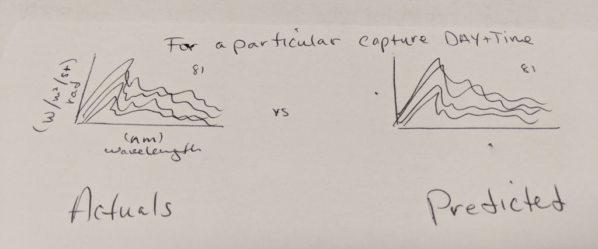

# Error Metrics

## Metrics Used by Prior Authors

* **RMSD - root mean squared deviation**  (always positive, more stable)  
* **MBD - mean bias deviation**  (postive/over or negative/under, more volatile)  
* **ratio - actual/predicted (measured/calculated) (or other way around)**  
* MAD - mean absolute deviation  
* MSD - mean squared deviation    
* R2 - coefficient of determination  
* SSB - spectral shape bias, normalize the radiance at Xnm with itself = Icam(lamda)/Iother(lamda) * Iother(550nm)/Icam(550nm) - 1 (550nm was used because that is where the they did calibration at)

## Considerations

R2 is unreliable for non-linear regression...  
http://blog.minitab.com/blog/adventures-in-statistics-2/regression-analysis-how-do-i-interpret-r-squared-and-assess-the-goodness-of-fit

Interesting...  
https://medium.com/human-in-a-machine-world/mae-and-rmse-which-metric-is-better-e60ac3bde13d  

_Serrano, D., Marín, M. J., Utrillas, M. P., Tena, F., & Martínez-Lozano, J. A. (2010). Measurement and modelling of global erythemal irradiance on inclined planes. Journal of Mediterranean Meteorology and Climatology, 7(1), 57-66._  
> "The RMSD statistic parameter gives the points which are furthest from the mean value greater weight than MAD, however Willmott and Matsuura (2005) recommend the use of MAD as an evaluation of average error. They always have positive values. By contrast, the MBD is the difference between the estimated and experimental value, corresponding to an overestimation or underestimation of the experimental values by the model (Utrillas et al., 1991b)."

_Iqbal, M. (2012). An introduction to solar radiation. Elsevier._  

## Actual vs Predicted (selected points)

If we do this, we should show actual and predicted of few distinctly different samples:
* solar disk (have to export this separate because circumsolar avoidance was used for export datasets) 
* cloud  
* clear sky  
* zenith  
* horizon  

 

## Actual vs Predicted Shape (normalized)

## Errors per Spectra

| Spectra    |            Range |
|------------|-----------------:|
| Visible    |      380 - 780nm | 
| VNIR       |     380 - 1400nm |
| SWIR       |    1000 - 2500nm |

## Actual vs Predicted (all 81 curves of a capture)

## Mean + Variance/STD (for all 81 curves of a capture)

## Whole Sky Selected Points

 

## Whole Sky Interpolation

  

